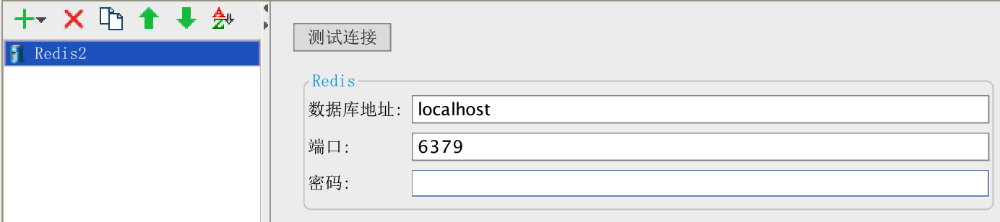
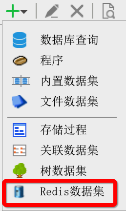
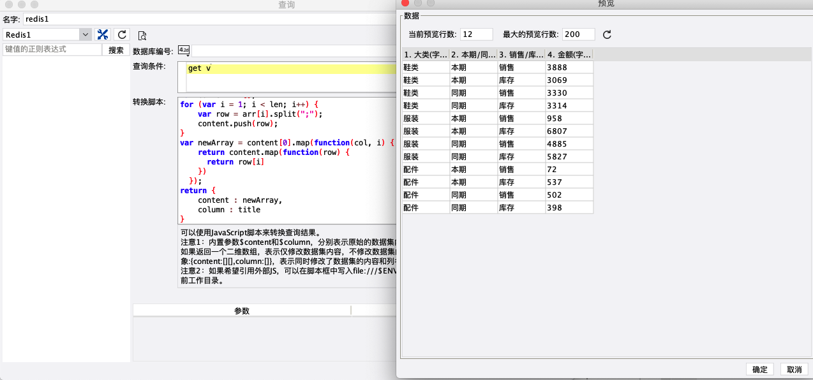

# 帆软报表连接redis缓存数据库插件
## 插件编译
进入插件源码目录，执行命令
`gradle zip`
即可在build/install下获得插件安装包

## 插件安装
使用帆软设计器自带的插件管理器即可安装。
## 插件使用
### 新建数据连接
安装完插件后，在新建数据连接的地方可以看到Redis类型的数据连接，点击新建后可以看到如下的界面：

按实际的配置填写上即可。

### 新建数据集
在模板数据集添加的地方会出现Redis数据集:

点击新建后会出现如下的界面，输入查询条件即可：

### 支持的查询语句

mget key [key ...]

hgetall key

lrange key 0 -1

smembers key

zrange key 0 -1

